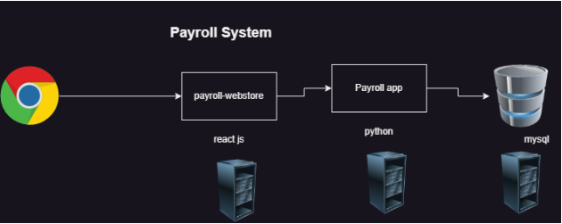
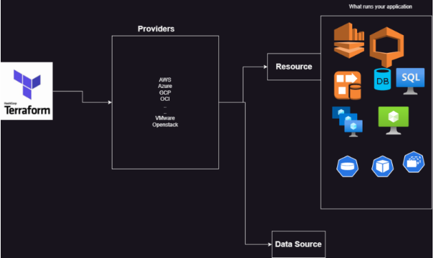
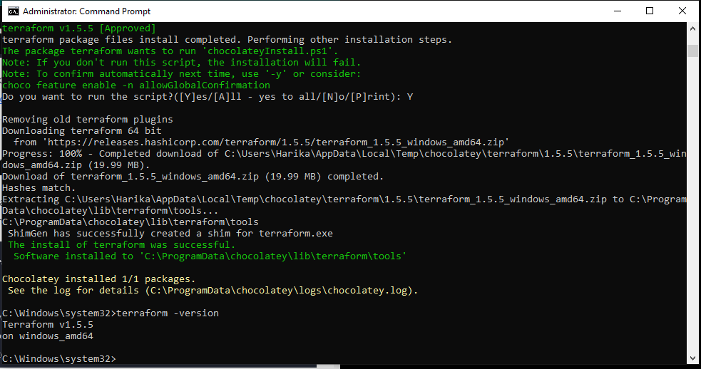
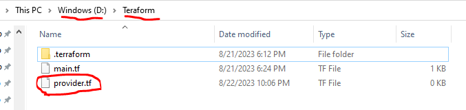
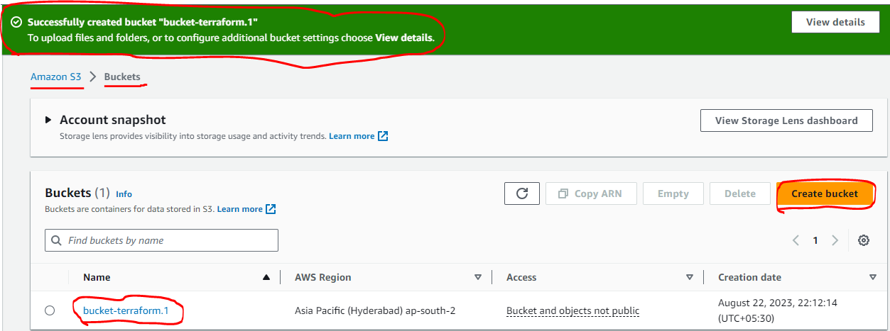
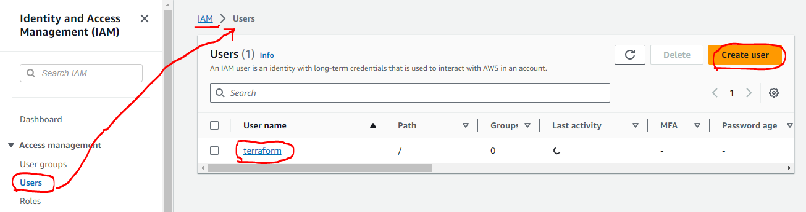
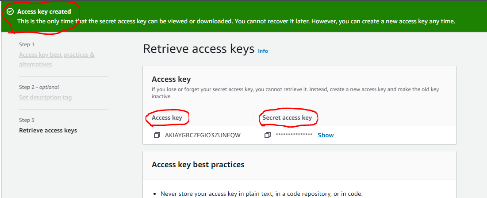
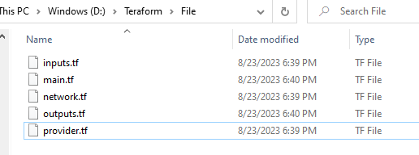
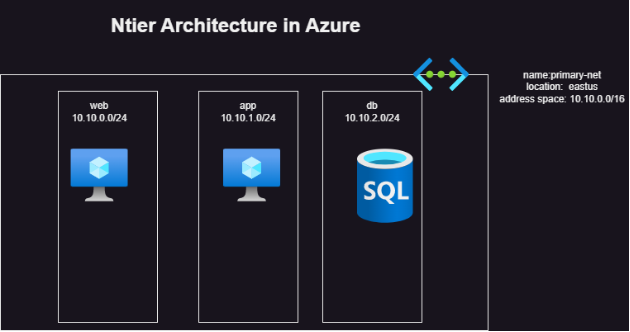

#### Problem Statement

* _**`Our ficticious Organization`**_ :
    * _**name**_ : Asquare info systems
    * _**Product**_ : iEcommerce
    * _**Purpose**_ : Any Organization can buy this project and host ecommerce applications
* This product is designed to work on any virtualized platform such as :
    * VMWare
    * OpenStack
    * AWS
    * Azure
    * GCP
* Now `Asquare info systems` needs to have an apporach to deploy the iEcommerce application into customers _**`Cloud/Virtual Environments`**_

#### Architecture of iECommerce : 



* _**`Infra for iECommerce`**_
    * Two networks with connectivity between them ( same building, different buildings, cities, countries )
    * In Each network :
        * _**Two Databases**_ :
            * MySql
            * RAM : 8 GB
            * Cpus : 2
            * Disk : 10 TB
        * _**one File Store**_ :
            * Size : 10 TB
        * _**3 Servers**_ :
            * OS : Ubuntu 22.04
            * RAM : 16 GB
            * Cpus : 2
            * Disk : 50 GB
* _**`Solution`**_ :
    * _**InfraProvisioning**_ : This represents using Infrastructure as a Code and deploy to target environment

### Understanding InfraProvisioning

* Analogy




* We use InfraProvisioing tools where we express our desired state about `Infrastructure as code`
* _**Terraform**_ : Can create infra in almost all the virtual environments
* _**ARM Templates**_ : Can create infra in Azure
* _**CloudFormation**_ : Can create infra in AWS
* Infraprovisiong tools use `IaC` which are generally idempotent
* _**Idempotance**_ is the property which states execution one time or multiple times leads to the same result
* `Reusability` is extremely simple and terraform can also handle multiple environments ( Developer, QA, UAT/Staging/Production )

### Terraform

* Terraform is an opensource tool developed by HashiCorp which can `create infra in almost any virtual platform`
* Terraform uses a language which is called as `Hashicorp Configuration Language (HCL)` to express desired State

#### Terms

* _**Resource**_ : The infrastructure `which you want to create`
* _**Provider**_ : To `where you want to create` the infrastructure
* _**Arguments**_ : The `inputs` which we express in terraform 
* _**Attribute**_ : The `output` given by terraform 

#### Installing terraform

* For official docs

    [ Refer here : https://developer.hashicorp.com/terraform/install ]



#### Developer Environment

* Install Visual Studio Code
* Ensure Terraform Extension is installed



* For installing necessary softwares on your windows system

    [ Refer here : https://www.youtube.com/watch?v=9guzVbZPGuw&t=703s ]

#### Creating basic terraform template

* Create a new folder `hellotf`
* open visual studio code
* Create a new file `main` with extension `.tf` - _**main.tf**_
* Choose any provider 

    [ Refer Here : https://registry.terraform.io/browse/providers?tier=official ]

* For aws provider

    [ Refer here : https://registry.terraform.io/providers/hashicorp/aws/latest ]

* Creating a template with `AWS`
```
terraform {
  required_providers {
    aws = {
      source = "hashicorp/aws"
      version = "4.58.0"
    }
  }
}

provider "aws" {
  # Configuration options
}

resource "aws_s3_bucket" "b" {
  bucket = "tf-s3-test-bucket"

  tags = {
    Name        = "My bucket"
    Environment = "Dev"
  }
}

resource "aws_s3_bucket_acl" "example" {
  bucket = aws_s3_bucket.b.id
  acl    = "private"
}
```
* We have executed the commands in following order
```
terraform apply     **
terraform init      #initialization
terraform apply     #applying the infra
yes                 #approval to create infra
terraform apply     #already existing
terraform destroy   #deleting the created infra
```


* Creating a template with `Azure`
```
terraform {
  required_providers {
    azurerm = {
      source = "hashicorp/azurerm"
      version = "3.47.0"
    }
  }
}

provider "azurerm" {
    features {}
}

resource "azurerm_resource_group" "example" {
  name     = "example-resources"
  location = "West Europe"
}

resource "azurerm_storage_account" "example" {
  name                     = "qttftestaccount"
  resource_group_name      = azurerm_resource_group.example.name
  location                 = azurerm_resource_group.example.location
  account_tier             = "Standard"
  account_replication_type = "GRS"

  tags = {
    environment = "staging"
  }
}
```
#### Basic workflow



#### N-Tier Application

* Consider the following architecture of a typical web application (ticket booking)



* To realize this application on `AWS`, the high level overview is :



* To realize this application on `Azure`, the high level overview is :



#### WOW (Ways of Working)

* Let's realize the architecture manually, make a note of :
  * resource
  * inputs
  * outputs
* Find resources in terraform to acheive the above manual steps

### Configuring a Provider in Terraform

#### Install Terraform on a linux machine

* Create a _**linux VM**_ and _**ssh**_ into it and execute the steps based on your distribution from here 

[ Refer here : https://developer.hashicorp.com/terraform/install ]


#### AWS Provider

* Terraform aws provider uses the `AWS API's` to get the infra created
* To Create infrastructure in your AWS Account, it needs `AWS programatic credentials (_**Secret access key and access key**_)`
* To configure these keys 

  [ Refer here : https://registry.terraform.io/providers/hashicorp/aws/latest/docs#authentication-and-configuration ]

* Create `IAM user` _**Secret access key**_ and _**Access key**_ and for manual steps

  [ Refer here : https://sst.dev/chapters/create-an-iam-user.html ]

* Let's write provider configuration
```
provider "aws" {
  region     = "us-west-2"
  access_key = "my-access-key"
  secret_key = "my-secret-key"
}
```
* This is not a great way as we are having sensitive information in the text format
* Best way is to _**install aws cli**_ on the machine with terraform and terraform will _**automatically pickup credentials**_ from there
* Installing aws cli 

  [ Refer here : https://docs.aws.amazon.com/cli/latest/userguide/getting-started-install.html ]

* Now your provider can be as simple as
```
provider "aws" {
    region = "us-west-2"
}
```