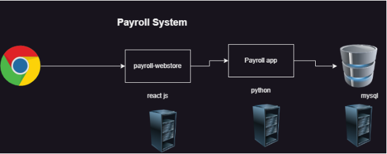

### Story of LT

* Basic architecture

    

* Let's say, LT has 3 customers who are ready to buy : 
    * TCS wants to run application on AWS
    * Infosys on Azure
    * JP Morgan on vmware
* How to automate these different deployments...?
    * Creating manually
    * For Automation:
        * AWS has Cloud formation
        * Azure has ARM Templates
* Terraform can automate infra creation in almost all the virtual environments 
* Terraform is an open source software and provides enterprise
* Terraform also allows us to deal with multiple environments

### ARCHITECTURE of Terraform

* Terraform is developed in Go language 
* Installation of terraform is one executable (only one'.exe' file)
* Providers are not part of terraform installations, as we try to create infra, as part of initializations providers are downloaded
* Providers have resources and datasources as part of them

    

### Concepts of Terraform

* Provider: This determines the target area to create infra structure
    * For the list of providers :

    [Refer here : https://registry.terraform.io/browse/providers]
* Terraform providers are of three categories :
    * Official
    * Partner
    * Community
* For providers documentation by Hashicorp

    [Refer here : https://developer.hashicorp.com/terraform/language/providers]

[ Note: For the reference we have used the following template ]
```
terraform {
  required_providers {
    aws = {
      source = "hashicorp/aws"
      version = "2.33.0"
    }
    azurerm = {
      source  = "hashicorp/azurerm"
      version = "=3.0.0"
    } 
  }
}

provider "azurerm" {
    features {

    }
}

provider "aws" {
    region = "us-west-2"
}

resource "aws_instance" "fromtf" {
    ami = "ami-03f65b8614a860c29"
    tags = {
      Name ="from terraform"
    }
    key_name = "my_id_rsa"
    vpc_security_group_ids = ["sg-05adaf452b268c335"]
    instance_type = "t2.micro"

}


resource "azurerm_resource_group" "test" {
    name = "test"
    location = "eastus"

}
```
* Arguments and Attributes:
    * Argument refers to inputs in terraform
    * Attributes refers to outputs in terraform

### INFRASTRUCTUE AS A CODE (IaC)

* This allows us to declare the infrastructure i.e. we would represent our needs in some format and the tool does the rest of creation/deletion/updating the resources
* We deal with declarative language and desired state

### Infra Provisioning

* This is about a tool which let's you express your infrastructure as a code and manages multiple environments and reusability

### TERRAFORM

* This is infra provisioning tool and supports infrastructure as code
* Terraform uses Hashicorp Configuration Language (HCL)

### WAYS OF WORKING with Terraform (First version)

* Create the infrastructure manually atleast once as this helps
    * in figuring out inputs to be passed
    * order of creation
    * every resource to be part of architecture
* Figure out the right provider and resources

### SYNTAXES in Terraform

1. PROVIDER : For official doc's

    [Refer here : https://developer.hashicorp.com/terraform/language/providers/configuration]
    * Syntax
    ```
    provider '<name-of-provider>' {
    arg-name-1 = arg-value-1
    ..
    arg-name-n = arg-value-n
    }
    ```
    * Example
    ```
    provider "aws" {
    region = "us-west-2"
    }
    ```
    * Generally we need to configure credentials for providers as well

2. RESOURCE: This represents the infrastructural element to be created 

    [Refer here : https://developer.hashicorp.com/terraform/language/resources/syntax]
    * Syntax
    ```
    resource "<resource_type>" "name" {
    arg-name-1 = arg-value-1
    ..
    arg-name-n = arg-value-n
    }
    ```
* Example
    ```
    resource "aws_instance" "fromtf" {
    ami = "ami-03f65b8614a860c29"
    tags = {
    Name ="from terraform"
    }
    key_name = "my_id_rsa"
    vpc_security_group_ids = ["sg-05adaf452b268c335"]
    instance_type = "t2.micro"</li>
    </ul>
    }
    ```
* Installing terraform 

    [Refer here : https://developer.hashicorp.com/terraform/tutorials/aws-get-started/install-cli]
* Commands - command prompt in administration mode
```
choco install terraform -y
terraform -version
```


### Activity-bucket: Create a s3 bucket

* Navigate to s3

=> AWS account => search s3 => s3 => Create bucket => Bucket name : bucket-terraform.1 => Bucket key : Enable => Create bucket

   

* Resource:
    * s3 bucket
* Inputs:
    * region
    * bucket name

### Infra Provisioning using Terraform

* Create an empty folder (D:\Teraform\s3-bucket => provider.tf)

    

* To Provider doc's
    
    [Refer here : https://registry.terraform.io/providers/hashicorp/aws/latest/docs]
* For basic user(IAM user) creation steps and take Access key and Secret Access key

    [Refer here : https://directdevops.blog/2023/07/27/aws-classroomnotes-27-jul-2023/] 
    
    [Refer here : https://sst.dev/chapters/create-an-iam-user.html]

=> IAM => Users => Create User => User name : terraform => Next => Attach policies directly => select AdministratorAccess => Next => Create user

     

=> select terraform user => select Security Credentials => Access Keys : Create access key => Command Line Interface (CLI) => Tick the checkbox => Next => Create access key

   

* Enter the folder created and perform the following
```
terraform init
terraform validate
terraform apply
```
* Let's find the resource

=> To find a resource search fore aws_s3_bucket in the terraform registry page

[Refer here : https://registry.terraform.io/providers/hashicorp/aws/latest/docs/resources/s3_bucket]
* Now look at argument reference of resource

    [Refer here : https://registry.terraform.io/providers/hashicorp/aws/latest/docs/resources/s3_bucket#argument-reference]
```
## Teraform\Activity-bucket\provider.tf

provider "aws" {
    access_key = "access"
    secret_key = "security-access"
    region = "ap-south-2"
}

resource "aws_s3_bucket" "first" {
    bucket = "terraform_bucket"
}
```
[NOTE : Adding credentials is not a safer approach to configure]
* Handling credenitals in AWS in  a safer approach : 
    1. install AWS CLI
    2. `aws configure`
* For sample activity without adding credentials directly
```
provider "aws" {
    region = "ap-south-2"
}

resource "aws_s3_bucket" "first" {
  bucket = "terraform_bucket"
}
```
* After completing the activity do 'terraform destroy'

### Activity: Create a storge account in Azure

* For the official doc's on how to create storage account

    [Refer here : https://learn.microsoft.com/en-us/azure/storage/common/storage-account-create?tabs=azure-portal]
* Resources:
    * Resource Group
        * Inputs:
            * name
            * location
    * Storage account
        * Inputs:
            * resource group name
            * location
            * name of storage account
* For Terraform Provider

    [Refer here : https://registry.terraform.io/providers/hashicorp/azurerm/latest/docs]
* To install AZURE CLI `az login`

    [Refer here : https://learn.microsoft.com/en-us/cli/azure/install-azure-cli]
* For resource group doc's

    [Refer here : https://registry.terraform.io/providers/hashicorp/azurerm/latest/docs/resources/resource_group]
 * For resource group doc's

    [Refer here : https://registry.terraform.io/providers/hashicorp/azurerm/latest/docs/resources/storage_account]
```
provider "azurerm" {
    features {     
    }
}

resource "azurerm_resource_group" "myresg" {
  name = "fromtf"
  location = "eastus"
}

resource "azurerm_storage_account" "first" {
    name = "fromtffortf"
    resource_group_name = "fromtf"
    location = "eastus"
    account_tier             = "Standard"
  account_replication_type = "GRS"
}
```
### Order of Creation of resources

* Order of creation can be acheived in two ways : 
    1. Explicit dependency : using `depends_on`
    
    [Refer here : https://developer.hashicorp.com/terraform/language/meta-arguments/depends_on]
```
provider "azurerm" {
    features {     
    }
  }

resource "azurerm_resource_group" "myresg" {
  name = "fromtf"
  location = "eastus"
}

resource "azurerm_storage_account" "first" {
  name = "fromtffortf"
  resource_group_name = "fromtf"
  location = "eastus"
  account_tier             = "Standard"
  account_replication_type = "GRS"
  depends_on = [ azurerm_resource_group.myresg ]
}
```
   2. Implicit dependency: Terraform figures out by looking at your configuration/template
        * When the output (attribute) of one resource is used as input (argument) to other
```
provider "azurerm" {
    features {     
    }
  }

resource "azurerm_resource_group" "myresg" {
  name = "fromtf"
  location = "eastus"
}

resource "azurerm_storage_account" "first" {
  name = "fromtffortf"
  resource_group_name = azurerm_resource_group.myresg.name
  location = azurerm_resource_group.myresg.location
  account_tier             = "Standard"
  account_replication_type = "GRS"
}
```
* To use one resource in other resource argument `<resource_type>.<name>.<Attribute_name>`
```
depends_on = [ azurerm_resource_group.myresg ]
```
### Best Practice to write terraform template (Based on what we have covered so far)

* Terraform reads all the `.tf` files in the folder and then combines as one file and executes the terraform => While writing terraform templates there is no need write everything in one file
    * From now one lets have one tf for provdier and then one tf file for logical group of resources.
    * All the variables will be in one file `inputs.tf` and all the outputs will be in the file `outputs.tf`


* Use `terraform fmt` to align the terraform template into common canonical format, for the changes done

    [Refer here : https://github.com/asquarezone/TerraformZone/commit/5d20b10dfe611bb6a2588f74723e48b4b002a01a]


### Manual Steps for next activity

* Azure


* AWS


### ntier network in Azure

* Manual steps:
    * Create a resource group
    * Create a vnet Refer Here for screenshots
    * network: 10.10.0.0/16
        * subnets:
            * web: 10.10.0.0/24
            * app: 10.10.1.0/24
            * db: 10.10.2.0/24


### Terraform implementation:

* For basic strucuture and terraform constraints added

    [Refer here : https://github.com/asquarezone/TerraformZone/commit/54c319951a6b6f6f38dd325bc03b55f215c2f443]
* For resource definitions done

    [Refer here : https://github.com/asquarezone/TerraformZone/commit/fe82b917ad18960ba8a87f5a2311b4fb7464a18f]
* For the variables added

    [Refer here : https://github.com/asquarezone/TerraformZone/commit/8fcc9aa67188b73e4240a5149ab03531daff36ba]
* To pass input variables we have two options
* option 1: from cli directly using `-var terraform apply -var 'resource_group_name=ntier-dev' -var 'location=eastus'`
* option 2: create a file with variable values 

    [Refer here : https://developer.hashicorp.com/terraform/language/values/variables#variable-definitions-tfvars-files]
*  For the changes to accomodate ntier with tfvars

    [Refer here : https://github.com/asquarezone/TerraformZone/commit/067f83585974f81f0d41332542d94ba6f5ddcf40]

### Terraform concepts

* Terraform block: 

    [Refer here : https://developer.hashicorp.com/terraform/language/settings]
    * Terraform block can help in setting provider requirements 
    
    [Refer here : https://developer.hashicorp.com/terraform/language/settings#specifying-provider-requirements] 
    * As well as terraform requirements 
    
    [Refer here : https://developer.hashicorp.com/terraform/language/settings#specifying-a-required-terraform-version]
    * There are other areas as well, which we will be discussing in later parts fo course
* Version constraints: 

[Refer here : https://developer.hashicorp.com/terraform/language/expressions/version-constraints]
* Data types: 

[Refer here : https://developer.hashicorp.com/terraform/language/expressions/types]
* Terraform input variables 

[Refer here : https://developer.hashicorp.com/terraform/language/values/variables]

### ntier network in AWS

* Manual steps:
    * Create a vpc
        * network: 10.10.0.0/16 => 10.10.x.x ( 10.10.0.0 to 10.10.255.255)


* For the changes

    [Refer here : https://github.com/asquarezone/TerraformZone/commit/c0a890c9a1216a15885790be91e61791914dc9ce]


* After terraform apply we are observing three new files
    * .teraform.lock.hcl
    * terraform.tfstate
    * terraform.tfstate.backup
* Let's add one subnet
    * cidr: 10.10.0.0/24 => 10.10.0.x => 10.10.0.0 to 10.10.0.255
    * name: web 1


* For the changes

    [Refer here : https://github.com/asquarezone/TerraformZone/commit/a91ca3ce662cef4819eddd1f654f6f424a8376b4]


* Exercise: Try adding 5 more subnets
```
web2: 10.10.1.0/24
db1: 10.10.2.0/24
db2: 10.10.3.0/24
app1: 10.10.4.0/24
app2: 10.10.5.0/24
```
### Concepts

* For terraform locals

    [Refer here : https://developer.hashicorp.com/terraform/language/values/locals]
* Terraform works:
    * Terraform when applied tries to figure out a plan to make the desired state an actual state (`terraform plan`)
    * Terraform creates a file called as terraform.tfstate when it first creates some resource
    * Terraform stores the information about the created resources in a json format called as `tfstate`
    * Terraform refresh updates the tfstate according to actual state


### ntier-aws: adding 5 more subnets

* CIDR Ranges
```
web2: 10.10.1.0/24
db1: 10.10.2.0/24
db2: 10.10.3.0/24
app1: 10.10.4.0/24
app2: 10.10.5.0/24
```
* For the changes which include usage of count

[Refer here : https://github.com/asquarezone/TerraformZone/commit/dc0107cb9ba9d7a8814a27f5a76c378af3a85a0a]


* For the changes which include usage of length

[Refer here : https://github.com/asquarezone/TerraformZone/commit/43daa844b4cdc1b90b7243fb03be02bb3da6acb4]
* For the usage of format function

[Refer here : https://github.com/asquarezone/TerraformZone/commit/95eb892246ae7b51b4f0903cd82f54cf6dee92d5]

### ntier-azure: adding 3 subnets

* CIDR Ranges
```
web: 10.10.0.0/24
app: 10.10.1.0/24
db: 10.10.2.0/24
```
* Changes done to accomodate multi resource creation

[Refer here : https://github.com/asquarezone/TerraformZone/commit/3cb7feb103c2460307889f5004da84f619eb94b6]


### Concepts

* Count: 

    [Refer here : https://developer.hashicorp.com/terraform/language/meta-arguments/count]
    
    * This argument can be used in resource block to create multiple resources
* Console: 

    [Refer here : https://developer.hashicorp.com/terraform/cli/commands/console]
* Functions 

    [Refer here : https://developer.hashicorp.com/terraform/language/functions]
    * Length function determines the length of collection 
    
    [Refer here : https://developer.hashicorp.com/terraform/language/functions/length]
    * Format function 
    
    [Refer here : https://developer.hashicorp.com/terraform/language/functions/format]

### Exercise

#### For AWS users

* Create a network with name primary in AWS cidr range `10.10.0.0/16`
    * Create 3 subnets
        * web `10.10.0.0/24`
        * app `10.10.1.0/24`
        * db `10.10.2.0/24`

* Create a network with name secondary in AWS cidr range `10.11.0.0/16`
    * Create 3 subnets
        * web `10.11.0.0/24`
        * app `10.11.1.0/24`
        * db `10.11.2.0/24`

### For Azure users

* Create a network with name primary in Azure cidr range `10.10.0.0/16`
    * Create 3 subnets
        * web `10.10.0.0/24`
        * app `10.10.1.0/24`
        * db `10.10.2.0/24`

* Create a network with name secondary in AWS cidr range `10.11.0.0/16`
    * Create 3 subnets
        * web `10.11.0.0/24`
        * app `10.11.1.0/24`
        * db `10.11.2.0/24`

### ntier-aws:

* Fixing CIDR range issue with terraform functions
* For the usage of CIDR subnet function

    [Refer here : https://github.com/asquarezone/TerraformZone/commit/a964d38011911412aed724953d6dd08981fde4e0]
* graph


* Try creating a security groups by using list(object) as input type

    [Refer here : https://registry.terraform.io/providers/hashicorp/aws/latest/docs/resources/security_group]
    * web
        * ingress:
            * http (80): allow to all
            * ssh (22): allow to all
    * app
        * ingress:
            * ssh (22): allow to all

### ntier-azure

* For the usage of cidrsubnet function to generate subnets

    [Refer here : https://github.com/asquarezone/TerraformZone/commit/b6c2519795931a2e64c4a1dbf20e3b51b47be364]
* graph


* Creating a Network security group for
    * web
        * incoming:
            * http (80): allow to all
            * ssh (22): allow to all
    * app
        * incoming:
            * ssh (22): allow to all
* For screen shots kindly refer classroom video
* For resource doc's

    [Refer here : https://registry.terraform.io/providers/hashicorp/azurerm/latest/docs/resources/network_security_group]
* For changeset with nsg and object usage

    [Refer here : https://github.com/asquarezone/TerraformZone/commit/334712d174fe77c35b19fcc4259e43a48c9d7e5f]

### Concepts

* For dealing with ip address related stuff terraform has ip functions and we have used cidrsubnet function to calculate subnet cidr based on network range 

    [Refer here : https://developer.hashicorp.com/terraform/language/functions/cidrsubnet]
* For generating graph or understading the order of creation we can use terraform graph command which generates graph in dot format 

    [Refer here : https://developer.hashicorp.com/terraform/cli/commands/graph] 
* Graph can be visualized 

    [Refer here : https://dreampuf.github.io/GraphvizOnline/#digraph%20G%20%7B%0A%0A%20%20subgraph%20cluster_0%20%7B%0A%20%20%20%20style%3Dfilled%3B%0A%20%20%20%20color%3Dlightgrey%3B%0A%20%20%20%20node%20%5Bstyle%3Dfilled%2Ccolor%3Dwhite%5D%3B%0A%20%20%20%20a0%20-%3E%20a1%20-%3E%20a2%20-%3E%20a3%3B%0A%20%20%20%20label%20%3D%20%22process%20%231%22%3B%0A%20%20%7D%0A%0A%20%20subgraph%20cluster_1%20%7B%0A%20%20%20%20node%20%5Bstyle%3Dfilled%5D%3B%0A%20%20%20%20b0%20-%3E%20b1%20-%3E%20b2%20-%3E%20b3%3B%0A%20%20%20%20label%20%3D%20%22process%20%232%22%3B%0A%20%20%20%20color%3Dblue%0A%20%20%7D%0A%20%20start%20-%3E%20a0%3B%0A%20%20start%20-%3E%20b0%3B%0A%20%20a1%20-%3E%20b3%3B%0A%20%20b2%20-%3E%20a3%3B%0A%20%20a3%20-%3E%20a0%3B%0A%20%20a3%20-%3E%20end%3B%0A%20%20b3%20-%3E%20end%3B%0A%0A%20%20start%20%5Bshape%3DMdiamond%5D%3B%0A%20%20end%20%5Bshape%3DMsquare%5D%3B%0A%7D]
* Variable type map or object 

    [Refer here : https://developer.hashicorp.com/terraform/language/expressions/types#maps-objects]

### ntier-aws:

* Try creating a security groups by using list(object) as input type

    [Refer here : https://registry.terraform.io/providers/hashicorp/aws/latest/docs/resources/security_group]
    * web
        * ingress:
            * http (80): allow to all
            * ssh (22): allow to all
    * app
        * ingress:
            * ssh (22): allow to all
            * ssh (8080): allow to all
    * db:
        * ingress:
            * tcp 3306: allow within vpc range

* For the changes to include security groups

    [Refer here : https://github.com/asquarezone/TerraformZone/commit/723f13d8ce8df16ca05927fba71b44246520c174]
* In AWS to make network work
    * We need to create an internet gateway and attach to vpc
    * We need to add route to the default route table to internet gateway
* Let's use datasource of route table to figure out the default route table id


* For the changes to make the network ready for next steps in 

    [Refer here : https://github.com/asquarezone/TerraformZone/commit/353297a5e3388042e029d20dd797124bdd912ec5]

* AWS


* Azure


### Concepts

* Datasources: Datasources in terraform allows us to fetch information from provider 

    [Refer here : https://developer.hashicorp.com/terraform/language/data-sources]
* Outputs: They print or expose the information/detail 

    [Refer here : https://developer.hashicorp.com/terraform/language/values/outputs]

### Exercise:

* Try Creating a
    * Azure VM/ AWS EC2
    * Azure SQL/AWS RDS mysql

### Creating kubernetes cluster from terraform

* For the changes

    [Refer here : https://github.com/CICDProjects/nopCommerceJuly23/commit/4d26cd8e07507075946a99e49097e0f8407fe051]
* Workflow


* For the k8s manifest

    [Refer here : https://github.com/CICDProjects/nopCommerceJuly23/commit/62fdd0c1e1493566a7f94b1daa1f6ad90c422fa2]
* Softwares
    * Terraform
    * azure cli
    * kubectl
* Manual deployment steps
```
cd deploy
terraform init
terraform apply -auto-approve
az aks get-credentials --resource-group rg-national-cod --name cluster-star-goat
kubectl apply -f ../k8s/nop-deploy.yaml
```
* For changes in jenkins file

    [Refer here : https://github.com/CICDProjects/nopCommerceJuly23/commit/1e31820e3b86fecd18754543f8ef78f9027e237c]

### Git Alias

[Refer here : https://www.atlassian.com/git/tutorials/git-alias]

### Git Hooks

[Refer here : https://directdevops.blog/?s=hooks]


* Navigate to hooks section

    [Refer here : https://directdevops.blog/2023/03/11/devops-classroomnotes-11-mar-2023/]
* For popular hooks

    [Refer here : https://github.com/aitemr/awesome-git-hooks]
* Since for hosted git repo’s like GitHub, GitLab we have no access to hooks folder, they give us webhooks 


    [Refer here : https://www.blazemeter.com/blog/how-to-integrate-your-github-repository-to-your-jenkins-project]
* For github actions approach instead of webhooks

    [Refer here : https://mickeygousset.com/blog/trigger-jenkins-pipeline-with-github-actions/]

### Git stash

* For stash doc's

    [Refer here : https://www.atlassian.com/git/tutorials/saving-changes/git-stash]

### ntier-aws: Creating a rds database in AWS

#### Manual steps:

* inputs:
    * region: us-west-1
    * database engine: mysql
    * db instance type/size: db.t2.micro
    * storage: 20 GB
    * vpc security group
    * db subnet group:
        * this is group of subnets

#### Terraform

* For the changes done to get subnet ids and create subnet by az’s

    [Refer here : https://github.com/asquarezone/TerraformZone/commit/58f2f66d8db35bfcc6c8ba2bda47ee5ab8c1e25c]
* For the changes to create database

    [Refer here : https://github.com/asquarezone/TerraformZone/commit/fceb15ec9ae5a27396d643c19a7b0ee550b0ee23]
* Now apply the changes


### ntier-azure: Creating an azure sql database

#### Manual steps:

* For manual steps

    [Refer here : https://learn.microsoft.com/en-us/azure/azure-sql/database/single-database-create-quickstart?view=azuresql-db&tabs=azure-portal]

#### Terraform

* For sql server resource

    [Refer here : https://registry.terraform.io/providers/hashicorp/azurerm/latest/docs/resources/mssql_server]
* For the changes in terraoform template

    [Refer here : https://github.com/asquarezone/TerraformZone/commit/64bdc196442e2292493a9c6dbdc4e35ed0eef923]

### ntier – aws

* For manual creation steps, refer classroom video
* Steps:
    * import key pair (generate key pair)
    * Figure out ami id for os `ami-0f8e81a3da6e2510a`
    * instance type `t2.micro`
    * select security group

#### Realizing in terraform

* We need to import key pair for resource

    [Refer here : https://registry.terraform.io/providers/hashicorp/aws/latest/docs/resources/key_pair]
* For the changes to import the key

    [Refer here : https://github.com/asquarezone/TerraformZone/commit/7c413cc8f4eac70ca241de14877f9f12703d28f2]
* For the changes in the template to accomodate the ec2 instance creation

    [Refer here : https://github.com/asquarezone/TerraformZone/commit/01588f5b3981e737a540a97bc1cc21266fb1cf40]
* AMI id as user input is an horrible idea, we need to fix that and multiple inputs for one ec2 instance can be combined into one variable (object/map)
* Exercise:
    * Try creating an ec2 instance in web subnet also with similar configuration

### Terraform – Concepts

* To read the contents of the file we have file function 

    [Refer here : https://developer.hashicorp.com/terraform/language/functions/file]
* Creating a key pair in terraform 

    [Refer here : https://registry.terraform.io/providers/hashicorp/tls/latest/docs/resources/private_key]
* For the sample using the creation

    [Refer here : https://github.com/asquarezone/TerraformZone/commit/d4f3c75a2e54702250f119cac78f1699c1ca5e97]
* Taint and untaint in terraform : 

    [Refer here : https://developer.hashicorp.com/terraform/cli/commands/taint]

### ntier – azure

* overview


* Let's create a vm in Azure, for manual steps refer class room video and for steps

    [Refer here : https://learn.microsoft.com/en-us/azure/virtual-machines/linux/quick-create-portal?tabs=ubuntu]
* For creating a vm in Azure we need
    * network: vnet
    * subnet
    * public ip address
    * network security group
    * network interface

### Realizing in terraform

* To Create a vm in azure, we need vnet, subnet, nsg, publicip, network interface


* We already have template written and we have created
    * vnet with subnets
    * nsg
* Now lets get started with rest
    * public ip 
    
        [Refer here : https://registry.terraform.io/providers/hashicorp/azurerm/latest/docs/resources/public_ip#argument-reference]
    * network interface 
    
        [Refer here : https://registry.terraform.io/providers/hashicorp/azurerm/latest/docs/resources/network_interface] 
    * Network interface and security group association

        [Refer here : https://registry.terraform.io/providers/hashicorp/azurerm/latest/docs/resources/network_interface_application_security_group_association]
* For the changes done to create public ip and network interface

    [Refer here : https://github.com/asquarezone/TerraformZone/commit/c626c322429b1142c7b32f0ec4b197af380b5d3c]
* Apply the template and view the resources


* For creating a linux vm for resource

    [Refer here : https://registry.terraform.io/providers/hashicorp/azurerm/latest/docs/resources/linux_virtual_machine]
* For the changes done to create a linux vm in azure

    [Refer here : https://github.com/asquarezone/TerraformZone/commit/47c8f199d91435e522f8bd969b88a2eeb744608d]


* Next Steps:
    * Provisioning
    * State management
    * Multi user
    * Multi environment

### Exercise

* Create a vm in web subnet in azure
* Create an ec2 instance in web1 subnet in aws

### Provisioners in Terraform

* For terraform provisioner offical doc's

    [Refer here : https://developer.hashicorp.com/terraform/language/resources/provisioners/syntax]
* Provisioner types : 
    * file: This can copy file into remote machine created by terraform
    * local-exec: this executes in the machine where terraform is executed
    * remote-exec: This executes in resource created by terraform
* Provisioner Connection: To establish remote connection, we need to pass connection information 

    [Refer here : https://developer.hashicorp.com/terraform/language/resources/provisioners/connection]

### ntier – aws. Install apache in ec2

* Manual steps for installing Spring-petclinic
```
sudo apt update
sudo apt install openjdk-11-jdk -y
cd /tmp && wget https://referenceapplicationskhaja.s3.us-west-2.amazonaws.com/spring-petclinic-2.4.2.jar
java -jar /tmp/spring-petclinic-2.4.2.jar &
```
#### Realizing using terraform

* For changes done

    [Refer here : https://github.com/asquarezone/TerraformZone/commit/5633d2e153350ec99f4a5783ec9ababab5d97621]
* For the next change, here also java is not found

    [Refer here : https://github.com/asquarezone/TerraformZone/commit/01900e614b279ece877a05ecfc5e7ffed72ca37a]

### ntier – azure

* For the latest changeset and try to execute and see the results

    [Refer here : https://github.com/asquarezone/TerraformZone/commit/0609c3d49d3f427de1c28e982aa641303f221b18]
* Try create a web vm or web ec2 and install apache in it
```
sudo apt update && sudo apt install apache2 -y
```
### Concept – Backend

* For official doc's

    [Refer here : https://developer.hashicorp.com/terraform/language/settings/backends/configuration]
* Terraform by default stores the state locally so multi user execution will create problems
* The default backend is local backend
* There are many other available backends 

    [Refer here : https://developer.hashicorp.com/terraform/language/settings/backends/configuration#available-backends]
* Next Steps:
    * Backend
    * Workspace
    * Modules and registry
    * State management:
        * import
        * state loss scenarios

### ntier-aws

* Let's apply backend to ntier-aws to store in s3 bucket 

    [Refer here : https://developer.hashicorp.com/terraform/language/settings/backends/s3]
* For the changes

    [Refer here : https://github.com/asquarezone/TerraformZone/commit/ae8fd24751687477de9dc238d189856f8463a205]
* As we have observed when multiple users try to execute at the same time only user gets the lock and others user have to wait till the lock is released


### ntier-azure

* For azurerm backend

    [Refer here : https://developer.hashicorp.com/terraform/language/settings/backends/azurerm]
* For the changes done to accomodate backends

    [Refer here : https://github.com/asquarezone/TerraformZone/commit/dce4b9dc1f964b3a7c3131a549d28c11d065981f]


* For the new vars for a qa environment

    [Refer here : https://github.com/asquarezone/TerraformZone/commit/cda1a1d28b99f7dacb2fa7f15192c835eb5ccaf3]
* Create a new workspace qa


* Once we create state file will be stored with qa information
* Exercise: Try doing the same workspace concept in aws

### Concepts

#### Workspaces

* Terraform workspaces allows us to create multiple environments from the same template.
* By default we were working with a workspace called as default
* For official doc's

    [Refer here : https://developer.hashicorp.com/terraform/cloud-docs/workspaces]

#### Other topics
* For each in terraform 

    [Refer here : https://developer.hashicorp.com/terraform/language/meta-arguments/for_each]
* For changeset

    [Refer here : https://github.com/asquarezone/TerraformZone/commit/d4731a139c29cd973167329c330358db5135de25]
* Conditional resource creation for conditional expression

    [Refer here : https://developer.hashicorp.com/terraform/language/expressions/conditionals]
```
resource "aws_s3_bucket" "item" {
  count      = terraform.workspace == "default" ? 1: 0
  bucket     = random_string.bucket_names[count.index].id
  depends_on = [random_string.bucket_names]
}


resource "random_string" "bucket_names" {
  count   = terraform.workspace == "default" ? 1: 0
  length  = 8
  special = false
  lower   = true
  numeric = false
}
```
#### Activity: Importing terraform resources

* Azure:
    * Create a resource group
    * Create a new folder in your system and configure terraform azurerm provider
* AWS:
    * Create a vpc
    * Create a new folder in your system and configure terraform aws provider

* Import command 

    [Refer here : https://developer.hashicorp.com/terraform/cli/import]
* Refer classroom video for importing resources

#### Exercise: Make a note of observation

* Create 3 s3_buckets/storage_accounts resources
    * Delete one resource from terraform and reexecute apply
* Out of 3 resources i dont want terraform to control one resource any more
* Importing a new resource into terraform state

## Reusability in terraform

### Create a vpc in AWS in mumbai
* For vpc module

    [Refer here : https://registry.terraform.io/modules/terraform-aws-modules/vpc/aws/latest]
* For the changes

    [Refer here : https://github.com/asquarezone/TerraformZone/commit/d4237dbf42ab47d4e12e74438aa42d00d8acea05]

### Create a module to create aws security group
* For the module created to create an aws security group

    [Refer here : https://github.com/asquarezone/TerraformZone/commit/ffd0c5d8f08ad983aeba98ed575330891e5dc7a2]
* Now let's try to use this module from local path

    [Refer here : https://github.com/asquarezone/TerraformZone/commit/258215c3f46f649b6bf576463ed6b921a1523a54]
* Try creating 2 security groups one in mumbai and one in oregon
* For module submitted in git

    [Refer here : https://github.com/dummyrepos/securitygroup] 

### Concepts: Module

* For official doc's

    [Refer here : https://developer.hashicorp.com/terraform/language/modules]
* Terraform registry is collection of public modules
* Modules can be used from various sources 

    [Refer here : https://developer.hashicorp.com/terraform/language/modules/sources]
* Terraform supports connecting to same cloud using provider with alias for different configurations as part of one deployment
    * In AWS if we want terraform to create resources in two different regions or two different accounts
    * In Azure to create resources in two different subscriptions/accounts

## Bringing up the Application to sell products online

* Overview


* Issues:
    * Bringing up the application
        * Lot of manual steps
        * Redoing the same work many times could be difficult
* The code for application developed is over here 
    [Refer here : https://github.com/nopSolutions/nopCommerce]

### Terms

* Continuous Deployment vs Continuous Delivery


* Pipeline


* Next Steps:
    * Container (Docker)
    * Container Orchestration (Kubernetes)
